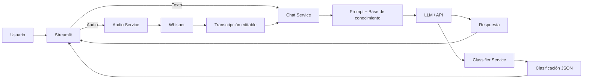

# HM Smart Support

**Asistente inteligente multimodal para postventa**

HM Smart Support es una aplicación desarrollada con **Python + Streamlit** que permite atender consultas de postventa mediante texto y audio, mantener el contexto de la conversación y clasificar las solicitudes según categoría y prioridad.

El proyecto utiliza una API compatible con OpenAI para la generación de respuestas y un servicio de transcripción basado en Whisper para convertir mensajes de voz en texto.

---

## Vista general

```text
┌──────────────────────────────────────────────────────────┐
│                    HM SMART SUPPORT                       │
├──────────────────────────────────────────────────────────┤
│                                                          │
│  💬 Chat                     🎙 Audio                     │
│    │                           │                         │
│    │                           ▼                         │
│    │                     Transcripción                  │
│    │                           │                         │
│    └───────────────┬───────────┘                         │
│                    ▼                                     │
│             Prompt + Contexto                            │
│                    │                                     │
│                    ▼                                     │
│                LLM / API                                 │
│                    │                                     │
│          ┌─────────┴─────────┐                           │
│          ▼                   ▼                           │
│      Respuesta          Clasificación                    │
│                          JSON                            │
│                                                          │
└──────────────────────────────────────────────────────────┘
```

---

## Características

* Chat mediante texto.
* Conversación con contexto durante la sesión.
* Historial visible de mensajes.
* Reinicio de sesión.
* Carga de archivos de audio.
* Transcripción de audio mediante Whisper.
* Soporte para **MP3, WAV y M4A**.
* Edición de la transcripción antes de enviarla.
* Uso de la transcripción como consulta del chatbot.
* Respuestas basadas en una base de conocimiento.
* Clasificación automática por categoría y prioridad.
* Salida estructurada en JSON.
* Manejo de errores de configuración y servicio.
* Reintentos y modelos de respaldo cuando corresponde.
* Selección de la versión del prompt.
* Métricas de tiempo de respuesta en la sesión.

---

## Tecnologías

| Tecnología           | Uso                                                  |
| -------------------- | ---------------------------------------------------- |
| Python               | Desarrollo de la aplicación y servicios              |
| Streamlit            | Interfaz web                                         |
| OpenAI Python Client | Comunicación con APIs compatibles con OpenAI         |
| Groq                 | Proveedor utilizado en la configuración del proyecto |
| Whisper              | Transcripción de audio                               |
| python-dotenv        | Gestión de variables de entorno                      |
| JSON                 | Base de conocimiento y salida estructurada           |
| CSV                  | Registro de resultados de pruebas                    |

---

## Arquitectura

La aplicación separa la interfaz de usuario de los servicios de inteligencia artificial.



### Componentes

**`app.py`**

* Construye la interfaz.
* Gestiona las pestañas de chat y audio.
* Mantiene el estado de la sesión.
* Muestra respuestas, clasificación y métricas.

**`services/chat_service.py`**

* Envía las consultas al modelo.
* Utiliza el historial de conversación.
* Controla el tiempo de respuesta.
* Gestiona reintentos y modelos de respaldo.

**`services/audio_service.py`**

* Valida los archivos de audio.
* Gestiona la transcripción.
* Devuelve el texto obtenido para utilizarlo como consulta.

**`services/classifier_service.py`**

* Clasifica la consulta.
* Determina categoría y prioridad.
* Genera la salida estructurada.
* Aplica la lógica de seguridad para situaciones críticas.

**`prompts/system_prompt.py`**

* Contiene las instrucciones del asistente.
* Define las versiones V1, V2 y V3.
* Define las reglas de comportamiento y formato de respuesta.

**`data/knowledge.json`**

* Contiene la información utilizada como base de conocimiento del asistente.

**`config.py`**

* Centraliza la configuración mediante variables de entorno.

---

## Estructura del proyecto

```text
HM-SmartSupport/
│
├── app.py
├── config.py
├── requirements.txt
├── README.md
├── .gitignore
├── .env.example
│
├── prompts/
│   └── system_prompt.py
│
├── services/
│   ├── chat_service.py
│   ├── audio_service.py
│   ├── classifier_service.py
│   └── errors.py
│
├── data/
│   └── knowledge.json
│
├── tests/
│   ├── run_tests.py
│   └── audio/
│
├── evidence/
│   └── matriz_pruebas_<version>.csv
│
└── docs/
    └── arquitectura.png
```

---

# Instalación

## Requisitos

Antes de ejecutar la aplicación se necesita:

* Python 3.x
* `pip`
* Conexión a Internet
* API Key para el servicio de chat
* API Key para el servicio de transcripción

---

## 1. Clonar el repositorio

```bash
git clone <URL_DEL_REPOSITORIO>
cd HM-SmartSupport
```

---

## 2. Crear un entorno virtual

### Windows

```bash
python -m venv .venv
.venv\Scripts\activate
```

### Linux / macOS

```bash
python3 -m venv .venv
source .venv/bin/activate
```

---

## 3. Instalar dependencias

```bash
pip install -r requirements.txt
```

---

## 4. Configurar las variables de entorno

Crear el archivo `.env` a partir de `.env.example`.

### Windows PowerShell

```powershell
Copy-Item .env.example .env
```

### Linux / macOS

```bash
cp .env.example
```

OPENAI_API_KEY=----------------------
OPENAI_BASE_URL=https://api.groq.com/openai/v1
OPENAI_MODEL=openai/gpt-oss-20b
OPENAI_FALLBACK_MODELS=openai/gpt-oss-120b,qwen/qwen3.8-27b

AUDIO_API_KEY=---------------------------
AUDIO_BASE_URL=https://api.groq.com/openai/v1
OPENAI_AUDIO_MODEL=whisper-large-v3


---

# Ejecución

Iniciar Streamlit con:

```bash
streamlit run app.py
```


# Uso de la aplicación

## Chat

Desde la pestaña de chat se puede:

1. Escribir una consulta.
2. Enviar el mensaje.
3. Recibir la respuesta del asistente.
4. Revisar la clasificación obtenida.
5. Continuar la conversación manteniendo el contexto.

Ejemplo:

```text
Usuario:
¿Qué mantenimiento necesita una remalladora?

Asistente:
[respuesta]

Usuario:
¿Y cada cuánto tiempo debo hacerlo?

Asistente:
[respuesta interpretando la referencia a la remalladora]
```

El historial se conserva temporalmente mediante `st.session_state`.

---

## Audio

La aplicación permite cargar un archivo de audio y convertirlo en una consulta del chatbot.

### Flujo

```text
Archivo de audio
      ↓
Validación
      ↓
Transcripción
      ↓
Texto editable
      ↓
Usar como consulta
      ↓
Chatbot
      ↓
Respuesta + clasificación
```

### Formatos admitidos

* MP3
* WAV
* M4A

### Validaciones

* El archivo debe tener un formato permitido.
* No puede estar vacío.
* El tamaño máximo permitido es de 25 MB.
* La transcripción debe contener texto.

La transcripción se muestra en la interfaz y puede modificarse antes de enviarla al chatbot.

---

# Clasificación

Cada consulta es clasificada de acuerdo con dos dimensiones:

### Categoría

```text
información
configuración
mantenimiento
garantía
repuesto
falla
servicio técnico
otros
```

### Prioridad

```text
baja
media
alta
crítica
```

La salida se genera en formato estructurado para facilitar su reutilización dentro de la aplicación.

Ejemplo:

```json
{
  "categoria": "falla",
  "prioridad": "alta",
  "equipo": "remalladora",
  "problema": "ruido anormal",
  "requiere_atencion_tecnica": true
}
```

---

# Prompt Engineering

El proyecto mantiene tres versiones del prompt para comparar su evolución.

### V1

Prompt inicial y mínimo:

```text
Responde preguntas sobre máquinas de coser.
```

### V2

Incorpora:

* Rol
* Contexto
* Usuario
* Tarea
* Formato
* Restricciones
* Tono

### V3

Añade:

* Delimitadores.
* Base de conocimiento.
* Reglas de comportamiento.
* Manejo de información desconocida.
* Control de consultas fuera de dominio.
* Reglas de seguridad.
* Ejemplos.
* Formato de salida.

La implementación de estas versiones se encuentra en:

```text
prompts/system_prompt.py
```

La versión activa puede seleccionarse desde la configuración de la aplicación.

---

# Base de conocimiento

La información utilizada por el asistente se encuentra en:

```text
data/knowledge.json
```

Esta base contiene información estructurada para temas como:

* mantenimiento preventivo;
* configuración;
* repuestos;
* códigos de error;
* fallas frecuentes;
* garantía;
* servicio técnico.

El prompt declara esta información como fuente principal para las respuestas del asistente.

---

# Manejo de errores

La aplicación dispone de mensajes controlados para situaciones como:

* API Key no configurada.
* API Key inválida.
* Falta de permisos.
* Límite de uso alcanzado.
* Modelo no disponible.
* Error de conexión.
* Tiempo de espera agotado.
* Archivo de audio no permitido.
* Archivo vacío.
* Audio sin transcripción válida.

La traducción de errores técnicos a mensajes comprensibles se gestiona desde:

```text
services/errors.py
```

---

# Pruebas

Las pruebas funcionales se encuentran en:

```text
tests/
```

Ejecutar la matriz principal:

```bash
python tests/run_tests.py
```

Ejecutar las pruebas con otra versión del prompt:

```bash
python tests/run_tests.py --prompt v1
```

```bash
python tests/run_tests.py --prompt v2
```

Calcular las métricas a partir de una matriz revisada:

```bash
python tests/run_tests.py --metricas
```

Los resultados se almacenan en:

```text
evidence/matriz_pruebas_<version>.csv
```

---

## Escenarios cubiertos

La matriz contempla 12 escenarios:

| ID   | Prueba                   |
| ---- | ------------------------ |
| CP01 | Consulta simple          |
| CP02 | Mantenimiento            |
| CP03 | Configuración            |
| CP04 | Consulta ambigua         |
| CP05 | Información desconocida  |
| CP06 | Tema fuera del dominio   |
| CP07 | Seguimiento con contexto |
| CP08 | Audio WAV                |
| CP09 | Audio MP3/M4A            |
| CP10 | Audio → chatbot          |
| CP11 | Falla técnica            |
| CP12 | Situación crítica        |

---

# Validación del prototipo

Resultados registrados en la versión evaluada:

| Indicador                           |  Resultado |
| ----------------------------------- | ---------: |
| Pruebas ejecutadas                  |         12 |
| Pruebas satisfactorias              |      11/12 |
| Tasa de pruebas satisfactorias      | **91.7 %** |
| Exactitud de clasificación evaluada |  **100 %** |
| Tiempo promedio de respuesta        | **7.86 s** |

Estos resultados corresponden a la ejecución del prototipo y sirven como evidencia de funcionamiento dentro del escenario académico.

---

# Seguridad

## Variables de entorno

Las credenciales no deben estar escritas directamente en el código.

Archivos utilizados:

```text
.env
.env.example
```

`.env` debe permanecer fuera del repositorio.

## `.gitignore`

El proyecto excluye archivos sensibles y generados localmente, incluyendo:

```text
.env
.venv/
__pycache__/
*.pyc
```

## Situaciones críticas

El sistema incorpora reglas específicas para consultas relacionadas con:

* humo;
* olor a quemado;
* chispas;
* descarga eléctrica;
* cortocircuitos;
* riesgo de lesión;
* riesgo de incendio.

Ante estas situaciones, la clasificación puede elevarse a prioridad crítica y la respuesta prioriza la seguridad.

---

# Configuración de modelos

La aplicación está preparada para trabajar con una API compatible con OpenAI.

La configuración principal se controla mediante:

```env
OPENAI_BASE_URL=
OPENAI_MODEL=
OPENAI_FALLBACK_MODELS=
```

En la configuración utilizada para la actividad, el proveedor por defecto es Groq mediante:

```text
https://api.groq.com/openai/v1
```

El servicio de chat puede utilizar modelos de respaldo definidos en las variables de entorno cuando se produce un fallo o límite de uso.

Para audio se configura el servicio de transcripción mediante:

```env
AUDIO_API_KEY=
AUDIO_LANGUAGE=es
```

---

# Contexto de sesión

Streamlit vuelve a ejecutar el script durante las interacciones del usuario. Para conservar el estado de la conversación, HM Smart Support utiliza `st.session_state`.

Entre los valores utilizados se encuentran:

```text
messages
times
audio_cache
ultima_audio
transcripcion_editable
uploader_n
version_prompt
```

Esto permite mantener el historial, reutilizar transcripciones y gestionar la sesión sin almacenar permanentemente las conversaciones.

---

# Limitaciones actuales

La versión del proyecto está planteada como un prototipo académico.

Actualmente no incluye:

* integración directa con WhatsApp;
* integración con teléfono o correo;
* persistencia del historial entre sesiones;
* precios y stock en tiempo real;
* datos reales de la empresa;
* despliegue productivo.

La base de conocimiento y las credenciales utilizadas dependen de la configuración local del proyecto.

---

# Próximas mejoras

Entre las posibles evoluciones del sistema se consideran:

```text
Base de conocimiento ampliada
            ↓
Integración con inventario
            ↓
Persistencia de conversaciones
            ↓
Mayor cobertura de pruebas
            ↓
Controles de privacidad
            ↓
Integración con canales externos
            ↓
Despliegue productivo
```

---

# Documentación del proyecto

Los archivos de soporte se encuentran dentro del repositorio:

```text
docs/
```

y

```text
evidence/
```

La arquitectura visual se encuentra en:

```text
docs/arquitectura.png
```

Los resultados de las pruebas se encuentran en:

```text
evidence/
```

---

# Integrantes

**Quintana Canorio Samir Erick**

**Sanchez Pajuelo Walter Jesus**

Curso: **Herramientas de Desarrollo Profesional TIC**

Docente: **Jonathan Arturo Jurado Sandoval**

